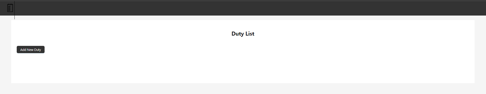
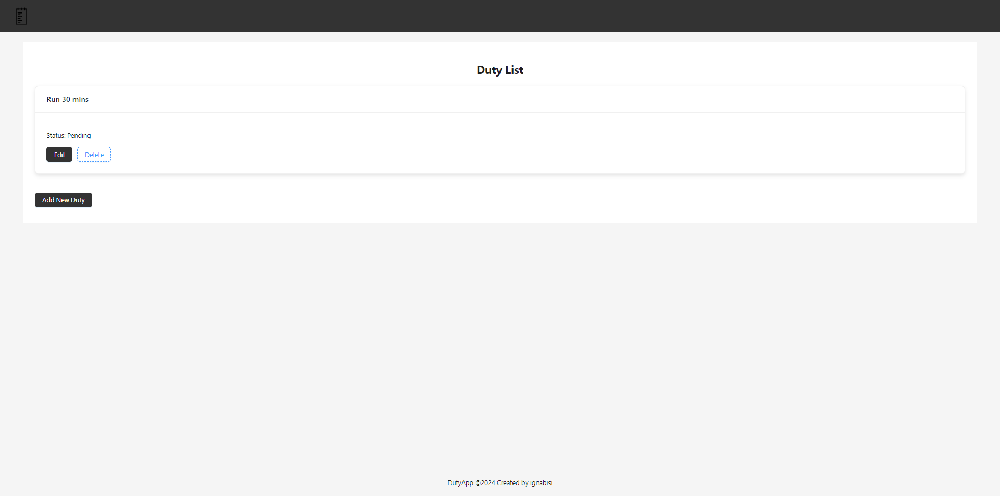
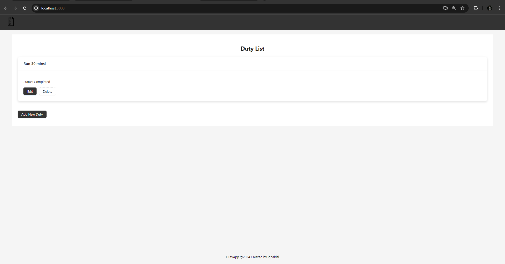

# Project DutyApp

## Introduction

DutyApp is a full-stack demonstration project showcasing how to set up a modern application using **React with TypeScript** for the frontend and **Node.js with TypeScript** for the backend, powered by **PostgreSQL** as the database. The project also includes **Jest** for running tests. This setup provides a solid foundation for building more complex applications by combining these popular technologies in a Dockerized environment.

## Requirements

To run the project, you need the following tools:

- **Ubuntu 22.04** (WSL2 on Windows is supported)
- **Docker** and **Docker Compose** for containerization
- **Node.js 16** (for local development)

## How to Set Up

This project includes several bash scripts located under the `/bin` folder to simplify running the application. Follow these steps to set up and run the project:

### Step 1: Make Scripts Executable

Run the following commands to grant executable permissions to the scripts:

```bash
sudo chmod +x /etc/scripts/start-db.sh
sudo chmod +x /etc/scripts/run-local.sh
sudo chmod +x /etc/scripts/stop-db.sh
```

### Step 2: Start the Database

To start the PostgreSQL database in detached mode (background):

```bash
./bin/start-db.sh
```

### Step 3: Run the Application

To run both the backend and frontend services, execute:

```bash
./bin/run-local.sh
```

This will spin up both the frontend and backend services.

- The frontend will be accessible on port 3000.
- The backend (Node.js API) will run on port 3002.

### Step 4: Running Tests

To test the application, simply run:

```bash
./bin/test-app.sh
```

### Project Structure and Tools
- Frontend: React with TypeScript and Ant Design, running on port 3003

```bash
http://localhost:3003
```

- Backend: Node.js with TypeScript, running on port 3002

```bash
http://localhost:3002
```

- Database: PostgreSQL
- Testing: Jest for both frontend and backend testing
- ESLint for both React (frontend) and Node.js (backend)

By utilizing Docker, the application is containerized for easy deployment and environment management.

### Final Tip

Don't forget to shut down the database when you're done—call bash stop-db.sh. After all, databases deserve some rest too, even in detached mode! 😄


### Screenshots

#### Empty Duty List



#### Add Duty with Form Validation


#### Duty Created



#### Update Duty

